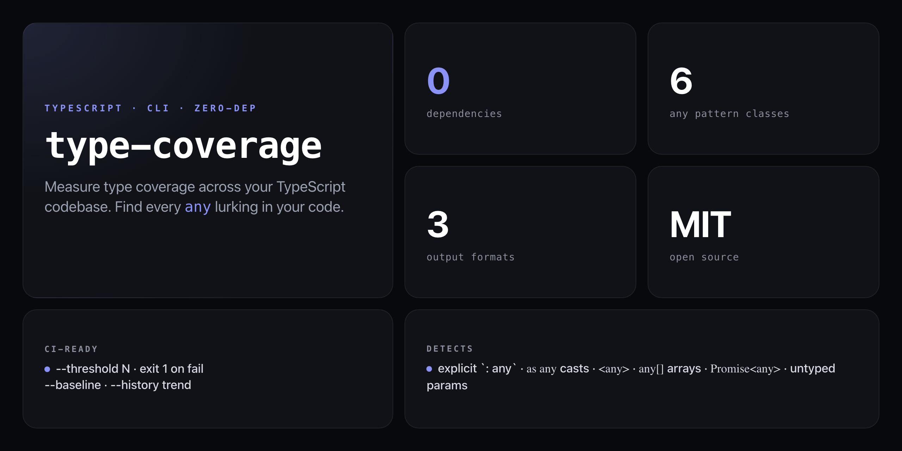

<div align="center">

**Measure TypeScript type coverage across your codebase. Because untracked `any` is technical debt you can't see.**


</div>

---

Every `any` you add silently disables type-checking for that expression — and TypeScript's built-in `--noImplicitAny` only catches a fraction of them. `type-coverage` walks your whole codebase, classifies every `any` pattern, shows you the worst offenders, and gates CI with a threshold you set.

```
type-coverage · 87 TypeScript files
━━━━━━━━━━━━━━━━━━━━━━━━━━━━━━━━━━━━━━

  Overall coverage: 84.2%  ████████████████░░░░

  Worst files:
  src/legacy/api.ts       41.2%  ██████████░░░░  18 any usages
  src/utils/parser.ts     63.7%  █████████████░   7 any usages

  any breakdown:
    explicit `: any`      23
    `as any` casts        11
    untyped params        31

━━━━━━━━━━━━━━━━━━━━━━━━━━━━━━━━━━━━━━
84.2% coverage · 73 any usages · Run with --detail for locations
```

## Install

No install required — runs straight from GitHub with zero dependencies:

```bash
npx github:NickCirv/type-coverage
```

## Usage

```bash
# measure coverage in the current directory
npx github:NickCirv/type-coverage

# fail CI if coverage drops below 85%
npx github:NickCirv/type-coverage --threshold 85

# show every any with its exact file and line
npx github:NickCirv/type-coverage --detail

# suggest replacement types for each any
npx github:NickCirv/type-coverage --detail --fix-hints

# save a baseline, then track the trend over time
npx github:NickCirv/type-coverage --baseline
npx github:NickCirv/type-coverage --history

# export a machine-readable report
npx github:NickCirv/type-coverage --output json > coverage.json
```

| Flag | Description |
|------|-------------|
| `--threshold <N>` | Exit 1 if coverage is below N% |
| `--detail` | Show every `any` usage with file + line |
| `--fix-hints` | Suggest a concrete type for each `any` |
| `--ignore <pattern>` | Exclude files matching a glob pattern (e.g. `"*.test.ts"`) |
| `--include <pattern>` | Analyse only files matching a glob pattern |
| `--output text\|json\|table` | Output format (default: `text`) |
| `--baseline` | Save current coverage as a baseline snapshot |
| `--history` | Show trend delta vs saved baseline |
| `--help` | Show help |

## What it detects

| Pattern class | Example |
|---------------|---------|
| Explicit `: any` | `const x: any = ...` |
| `as any` cast | `value as any` |
| `<any>` cast | `<any>value` |
| `any[]` array | `items: any[]` |
| `=> any` return | `(): any => ...` |
| `Promise<any>` | `async fn(): Promise<any>` |
| Untyped params | `function f(x) { ... }` — no annotation on `x` |

## CI usage

Exit code is `1` if the threshold is not met, `0` otherwise — so it gates the build cleanly:

```yaml
- name: Check TypeScript type coverage
  run: npx github:NickCirv/type-coverage --threshold 80
```

Save a baseline once and track regressions over time:

```yaml
- name: Type coverage trend
  run: npx github:NickCirv/type-coverage --history --threshold 80
```

## What it is NOT

- **Not a TypeScript compiler replacement.** It uses regex-based analysis, not the TS compiler API — fast and zero-dep, but it won't catch every edge case the compiler would.
- **Not a linter.** It measures and reports; it doesn't auto-fix. Use `--fix-hints` for suggested replacements and apply them manually.
- **Not a `--strict` substitute.** Enabling `strict` in your `tsconfig.json` is still the right foundation — this tool gives you the coverage number you can put in a badge and track over PRs.

---

<div align="center">
<sub>Zero dependencies · Node 18+ · MIT · by <a href="https://github.com/NickCirv">NickCirv</a></sub>
</div>
